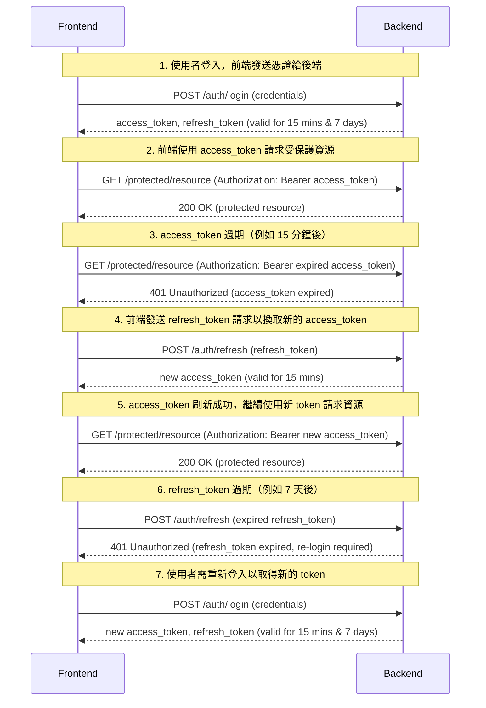

# Cts Back End

- 專案名稱：cts-back-end
- 本機端網址：http://localhost:3000

此為 [catching-the-star-master](https://github.com/a131381568/ctsm-sql) 的後端重構專案

## A. 簡述
此專案為 [cts-front-end](#) 的後端系統，不同於原本舊後端的 GraphQL，是使用 RESTful 的 [NestJS](https://docs.nestjs.com/) 開發

## B. 使用技術

- 資料庫: PostgreSQL
- 資料庫溝通: Prisma
- 後端框架: NestJs 
- 身份驗證: Passport, JWT
- API 合約: ts-rest, zod
- 加密解密: CryptoJS/Bcrypt
- 生成 ID: Nano ID
- API 文件: Bruno

## C. 詳盡資訊

### C-1 登入邏輯



### C-2 資料表架構關聯


### C-3 API
使用 [Bruno](https://github.com/usebruno/bruno) 作為測試 API 的工具，且文件檔在`apps/cts-back-end/bruno`，能夠跟著進版控


### C-4 專案間的依賴關係
- [專案依賴](#)
- [查看前端專案](#)
- [查看共享專案](#)


## D. 本地開發

1. 啟動資料庫與 pgAdmin
```shell
pnpm exec nx docker:d cts-back-end

```

2. 起本地 NestJS Server
```shell
pnpm exec nx serve cts-back-end
```
- 每次起後端 Server 時，都會觸發`copy-env`指令
- 需要讓`.env`放置在`apps/cts-back-end/bruno`下才會生效

3. 檢查程式碼
```shell
pnpm exec nx lint cts-back-end
```

4. 遷移資料庫
```shell
pnpm exec nx prisma:m cts-back-end
pnpm exec nx prisma:g cts-back-end
```

## D. 打包

1. 將前後端檔案打包至`dist/cts`
```shell
 pnpm exec nx deploy cts-back-end
```

2. 將 `dist/cts` 內的檔案搬移到要部署的地方後, 在根目錄建立容器
```shell
docker-compose up -d
```

## E. 部署

https://railway.app/
