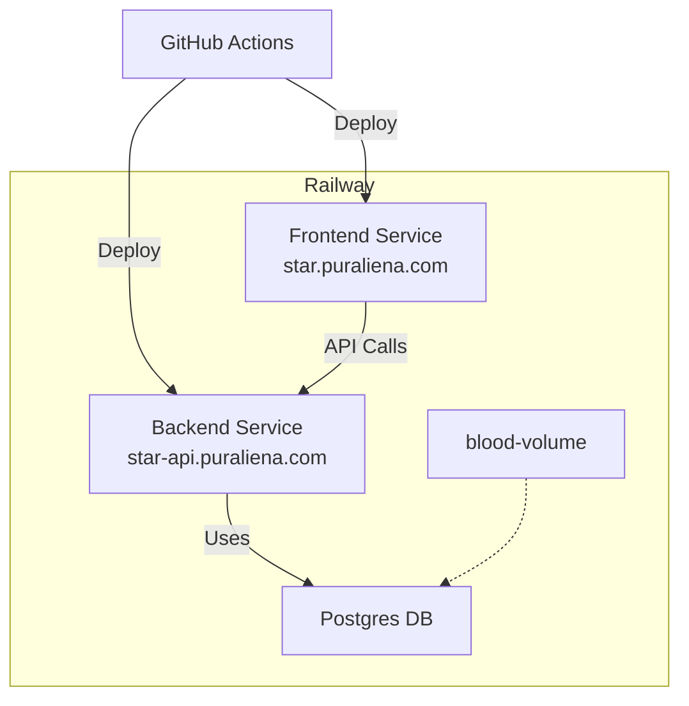

# Cts Shared

- 專案名稱：cts-shared

> 此為 cts 的共享專案，可以分別給前後端使用裡面的資源

- constants: 靜態文字設定檔
- contracts: API 合約
- dto: 常用的共享傳遞資料結構
- schemas: 資料表相關的結構, 與相關的驗證器
- types: 共用型別

## railway 相關

使用第三方的 [railway.app](https://railway.app/) 來做容器部署託管

- 部署採用 railway 的 GitHub 整合，指定倉庫跟分支，來達到自動部署的效果
- libs/cts-shared/.env.example：有全部的環境變數欄位
- Postgres 由 railway 託管，只要輸入環境變數，就能使用；藉由連線託管資料庫，來備份、倒資料了
- 可以使用 [railwayapp/cli](https://docs.railway.com/reference/cli-api#up) 來開發測試部署作業
- 前端藉由 Nginx, Node 的容器，來裝打包出來的 Vue
- 後端端藉由 Node 的容器，來裝打包出來的 NestJS

## railway 專案 ctsb_nx

## 部署邏輯

